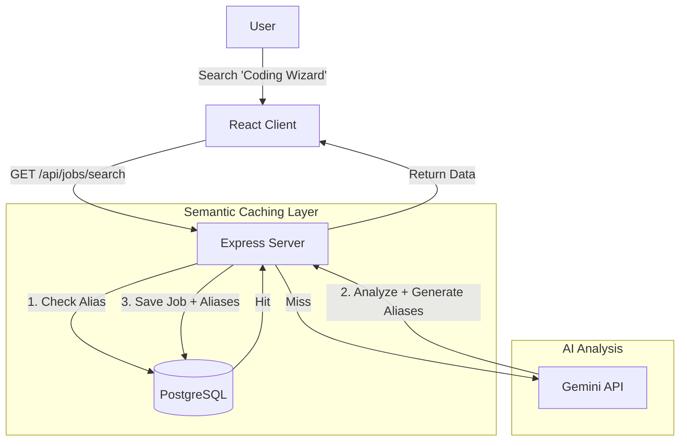

# AI Job Market Watch 

A full-stack application that analyzes job markets using AI, featuring an intelligent caching layer to optimize performance and costs. 
[Link to site](https://ai-job-market-watch.onrender.com/)
## System Architecture



## Key Features

### 1. AI-Powered Analysis
- Uses **Google Gemini 1.5 Flash** to generate real-time insights.
- Provides automation scores, future predictions (5y/10y/20y), and "Human Edge" skills.

### 2. Semantic Caching (Proactive)
- **Problem**: "Software Engineer" and "Software Engineering" are the same job but would normally be cached separately.
- **Solution**:
    - We ask AI for the **Canonical Title** (e.g., "Software Engineer").
    - We ask AI for **Aliases** (e.g., "Developer", "Coder").
    - We save **ALL** of them to the `JobAlias` table.
- **Result**: Searching for *any* synonym hits the same cache entry instantly.

## Verification Steps

### Prerequisite
Ensure your server is running:
```bash
cd server
node index.js
```

### Test Case: The "Proactive" Cache
1.  **Search for a new term**: `Quantum Chef`
    - **Status**: Slow (AI Generating...)
    - **Logs**: `Creating NEW Job: Quantum Chef`, `Saving aliases: quantum chef, molecular gastronomist...`
2.  **Search for a synonym**: `Molecular Gastronomist`
    - **Status**: **INSTANT** ⚡
    - **Logs**: `Cache HIT (Alias) for: Molecular Gastronomist -> Quantum Chef`

## Project Structure
- `client/`: React + Vite + Tailwind CSS
- `server/`: Express + Sequelize + PostgreSQL
    - `models/Job.js`: Stores the core analysis.
    - `models/JobAlias.js`: Stores the search term mappings.
